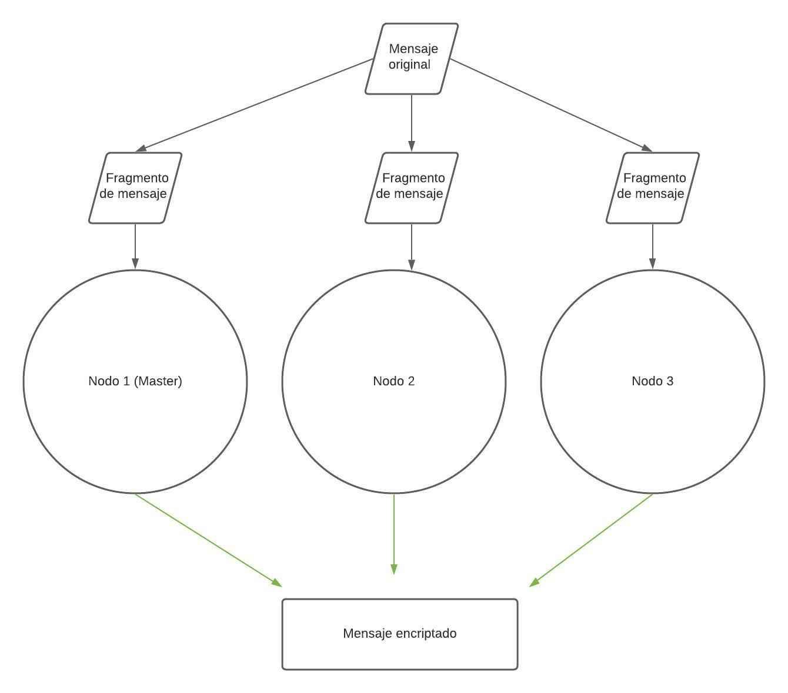
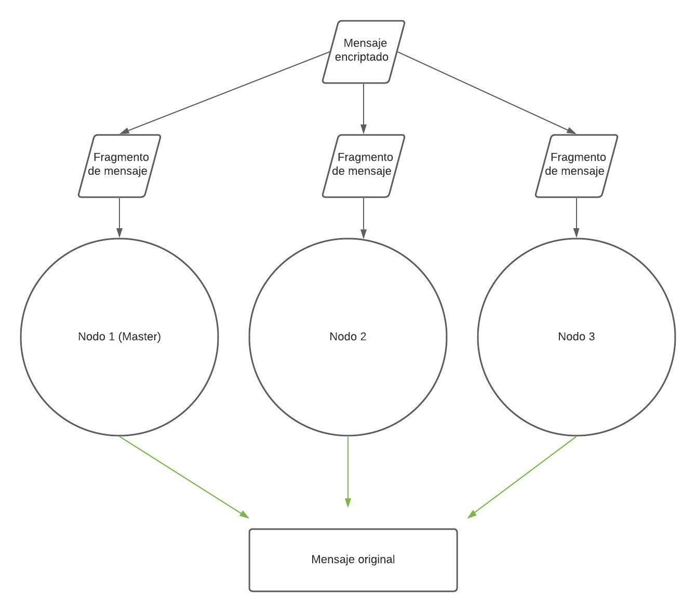

# *Caesar Encode & Decode*
---
#### Materia: *TC2025-Programación Avanzada*

##### Integrantes:
1. *Ana Paola Minchaca García* - *A01026744* 
2. *Karen Isabel Morgado Castillo* - *A01027446* 

---
## 1. Aspectos generales

Las orientaciones de la tarea se encuentran disponibles en la plataforma **Canvas**.

Este documento es una guía sobre qué información debe entregar como parte del proyecto, qué requerimientos técnicos debe cumplir y la estructura que debe seguir para organizar su entrega.

### 1.1 Requerimientos técnicos

A continuación se mencionan los requerimientos técnicos mínimos del proyecto, favor de tenerlos presente para que cumpla con todos.

* Toda la programación debe realizarse en C.
* La solución al problema debe utilizar el máximo nivel de paralelismo posible, utilizando PThreads u OpenMP y MPI.
* La solución debe ejecutarse en un clúster formado como mínimo por el mismo número de nodos que integrantes tenga el equipo.
* Se debe realizar un análisis de los problemas de concurrencia que se pueden presentar y resolverse de la manera correcta, evitando en todo momento las esperas activas.
* Para resolver los problemas de concurrencia se deben utilizar algunas de las técnicas estudiadas en el semestre.
* Todo el código y la documentación del proyecto debe alojarse en este repositorio de GitHub. Favor de mantener la estructura de carpetas propuesta.
* El código debe estar documentado siguiendo los estándares definidos para el lenguaje de programación C.

### 1.2 Estructura del repositorio

El proyecto debe seguir la siguiente estructura de carpetas:
```
- / 			        # Raíz de todo el proyecto
    - README.md			# Archivo con los datos del proyecto (este archivo)
    - source			# Carpeta con el código fuente de la solución
    - docs			    # Carpeta con la documentación del proyecto: PDF, imágenes, etc.
```

### 1.3 Documentación  del proyecto

Como parte de la entrega final del proyecto, se debe incluir la siguiente información:

* Descripción del problema a resolver.
* Análisis exhaustivo de los problemas de concurrencia que se presentan y una explicación clara de cómo se resuelve cada uno de ellos en la solución propuesta.
* Análisis exhauistivo de los inhibidores del paralelismo presentes en el problema planteado y una explicación clara de cómo se resuelve cada uno de ellos en la solución implementada.
* Diagrama con la arquitectura de la solución que incluya: nodos del clúster, componentes de código que se ejecuta en cada nodo, si se hace un *scatter*, *gather*, indicar quien es el nodo maestro y cuáles son los nodos obreros, etc.
* Descripción de cada uno de los componentes de la solución.
* Guía de configuración, compilación y ejecución de la solución implementada y todos los componentes, liberías, etc. que se requieran.

## 2. Descripción del problema

El cifrado César es una de las técnicas de cifrado más usadas y más simples, consiste en que una letra del texto original sea reemplazada por otra letra que se encuentra un número fijo de posiciones más adelante en el alfabeto.
Un ejemplo de esto sería si tuvieramos lo siguiente: "Ana y Karen", si nosotros escogiéramos que la llave para encriptar este mensaje fuera de 3, esto significa que se desplazaría 3 espacio a la derecha, teniendo como resultado: "Dqd b Nduhq".
Es un método bastante útil, sin embargo, al encriptar y desencriptar archivos de mayor magnitud puede resultar un poco lentas las operaciones.

## 3. Solución

A continuación aparecen descritos los diferentes elementos que forman parte de la solución del proyecto.

### 3.1 Análisis de concurrencia

Como ya se mencionó uno de los problemas encontrados fue que al realizar las operaciones solo las realizaba una máquina, por lo que se programó de manera que se leyera el archivo de manera paralela por tres máquinas distintas, usando de auxiliar OpenMP y MPI.

### 3.2 Análisis de los inhibidores del paralelismo

Los inhibidores que encontramos dentro de nuestro proyecto fueron los siguientes:
* Lectura de archivos(texto): Esta parte de nuestro código se realiza de manera secuencial, por que es importantes ir leyendo los datos como van entrando. Esto para no desorganizar el mensaje y que ya no se pueda encriptar/desencriptar, además pensándolo en un ejemplo más complejo como lo serían las llaves públicas, si esto no se realiza de manera secuencial sería un gran problema. Podríamos encontrar más paralelización en esta parte si no importara el orden del mensaje, como lo es en nuestro ejemplo, pero, como mencioné antes, si esto fuera a un problema más complejo se debería realizar de manera secuencial. 
* Imprimir el resultado en consola: Aquí ocurre lo mismo que se explicó anteriormente, esto se debe imprimir de manera secuencial si queremos tener el mensaje en el mismo orden que se mandó por lo que es algo que aunque si se podría paralelizar, en este caso no aplica ya que nos importa el orden del mensaje. 
* Orden del algoritmo: Al estar usando el algoritmo de Caesar Cipher, no podemos cambiar realmente el orden en el que ocurren las cosas, por lo que se debe hacer secuencialmente, primero leemos el mensaje, lo separamos, hacemos que se encripte y lo juntamos al final. No podemos simplemente mover el orden en el que ocurren las cosas por que así es como ocurre el algoritmo. Si fueramos a lograr un mayor nivel de paralelización entonces la opción sería hacerlo con el código enigma que usa rotores y tiene un nivel de complejidad mayor entonces se podría aprovechar la paralelización. 

### 3.3 Arquitectura de la solución
Encode


Decode

 
### 3.4 Descripción de los componentes

Como vemos en el primer diagrama que corresponde a la parte del cifrado, nosotras empezamos con un texto o mensaje inicial que deseamos encriptar, a este mismo se le da una llave, nosotras usamos una llave fija de 2 pero realmente este valor puede cambiar. A partir de ahí hacemos uso del MPI Scatter que es el que se va a encargar de separar partes del mensaje en los nodos/máquinas para que esté todo distribuido y que a la hora que hagamos el MPI Gather podamos juntar todas las partes ya encriptadas del mensaje y tener un solo mensaje encriptado. 

Lo mismo ocurre en el diagrama para desencriptar el mensaje, empezamos con el mensaje encriptado que se va a separar por partes con el MPI Scatter en los nodos/máquinas que estamos utilizando para que esté distribuido y pueda ser desencriptado, para finalmente juntar todo con el MPI Gather y que tengamos el mensaje original que teníamos desde un principio. 

De igual forma, es importante mencionar que se paralelizó el algoritmo con el que encriptamos y desencriptamos el mensaje con el uso de OpenMP.

## 4. Pasos a seguir para utilizar el proyecto

### 4.1 Dependencias y requisitos

* MPI: MPI o Message Passing Interface es una especificación para programación de paso de mensajes, que proporciona una librería de funciones para C, C++ o Fortran que son empleadas en los programas para comunicar datos entre procesos.
* OpenMP: OpenMP es una interfaz de programación de aplicaciones (API) para la programación multiproceso de memoria compartida en múltiples plataformas. Permite añadir concurrencia a los programas escritos en C, C++ y Fortran sobre la base del modelo de ejecución fork-join.
* Vagrant: Vagrant es una herramienta para la creación y configuración de entornos de desarrollo virtualizados.
* VirtualBox: VirtualBox es una aplicación que sirve para hacer máquinas virtuales con instalaciones de sistemas operativos.

#### 4.1.1 Frameworks
* No aplica para este proyecto

#### 4.1.2 Librerías de funciones o dependencias
* MPI
* OpenMP

#### 4.1.3 Guía de uso

1. Instala [VirtualBox](https://www.virtualbox.org/)
2. Instala [Vagrant](https://www.vagrantup.com/)
3. Crea una carpeta nombrada mpi-vagrant en tu computadora
4. Descarga a la carpeta mpi-vagrant los archivos Vagrantfile y machines
5. Abre una Terminal en tu computadora y cámbiate a la carpeta mpi-vagrant
6. Clona el repositorio con el comando:

        git clone https://github.com/tec-csf/tc2025-proyecto-final-equipo10-ana-karen

7. Inicia el clúster:

        vagrant up
8. Una vez que termine el comando anterior, accede por SSH al nodo 1 con el comando: 
        
        vagrant ssh node1

* Desde el nodo 1, verifica que tienes conectividad al nodo 2 con el comando: ssh node2. La primera vez te preguntará si aceptas que se adicione la llave al archivo de autorización, selecciona que si (Y) y continua.
* Regresa al nodo 1 con el comando: exit
* Desde el nodo 1, verifica que tienes conectividad al nodo 3 con el comando: ssh node3. La primera vez te preguntará si aceptas que se adicione la llave al archivo de autorización, selecciona que si (Y) y continua.
* Regresa al nodo 1 con el comando: exit

9. Una vez estando dentro del nodo 1:
* Nos movemos a la ubicación del código:

        cd /vagrant/tc2025-proyecto-final-equipo10-ana-karen/source
* Compilamos el código:
        
        mpicc caesar_encode.c -fopenmp
        mpicc caesar_decode.c -fopenmp
* Corremos el código:

        mpirun -np 3 -f /vagrant/machines ./a.out
10. Desconéctate del nodo 1 con el comando: exit
11. Apaga el cluster con el comando: vagrant halt

## 5. Referencias

1. [OpenMP](https://es.wikipedia.org/wiki/OpenMP)
2. [MPI](http://informatica.uv.es/iiguia/ALP/materiales2005/2_2_introMPI.htm)
3. [Cifrado César](https://es.wikipedia.org/wiki/Cifrado_C%C3%A9sar)
4. [Vagrant](https://es.wikipedia.org/wiki/Vagrant_(software))
5. [VirtualBox](https://www.xataka.com/basics/virtualbox-que-como-usarlo-para-crear-maquina-virtual-windows-u-otro-sistema-operativo)
